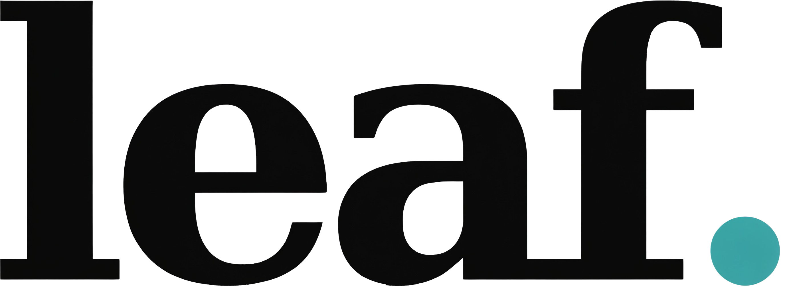

---

*「一叶落地，一念生根。」*

不是 Leaf. 的新家，是它的旧居。

专门为那些跑不动新系统的老设备们重新打扫过的角落。没有花哨的依赖，没有复杂的构建流程，只把 Leaf. 最核心的那片叶子轻轻放回它们还能握住的掌心。

---

**为什么会有 leaf**

主仓库的 Leaf. 是为现代设备打造的——它用最新的工具链、最新的语法、最新的 API。

但很多人的设备，还没到该被扔掉的时候。

它们还能开机，还能亮屏，还能打开一个浏览器窗口。但那些新软件已经不再等它们了——安装包拒绝解压，页面加载到一半卡住，操作一步一帧地跳。不是它们不想跑，是现在的软件，已经忘了还有人在用它们。

leaf 就是为这些设备留的一盏灯。

没有新的依赖，没有新的构建工具，没有新的框架版本。只有干净的 HTML、CSS 和 JavaScript，用浏览器本身就能读懂的语言，重新写了一遍。

你不用问“它还能用多久”，你只需要知道：当你打开它的那一刻，它还在。

---

**leaf 不是什么**

- 不是 Leaf. 的替代品

- 不是功能更全的版本

- 不是为现代设备设计的

- 不是 All-in-One 平台

它只是 Leaf. 最核心的那片叶子，放进老设备还能跑得动的壳里。

---

**设计原则**

| 原则 | 说明 |
|:---|:---|
| **无 AI** | 不替你思考，不替你总结，不替你写。只存储你写下来的。 |
| **零付费** | 功能全开放，不设付费墙。你不需要为“导出”或“同步”付钱。 |
| **开源** | 你可以 fork，可以修改，可以把它变成你自己的版本。 |
| **轻量** | 不安装，不更新，不后台运行。老设备也能跑得动。 |
| **Less is more** | 不做平台，只做工具。即用即走。 |

---

**技术选型**

- 纯文本 + Markdown：你写什么，它就存什么。不额外加层。

- 本地存储：数据存在你自己的设备里，不上传，不依赖云端。

- 单 HTML 文件：不需要安装，不需要构建工具，不需要依赖。

---

**情怀**

有些人说，硬件是消耗品，该换就换。

但那是把设备当“工具”的人说的话。

把设备当“物件”的人，不会这么想。物件不是用坏了才换的，它是在你心里已经变了样的时候，还愿意继续用下去的东西。

leaf 不是为了让“老设备也能用”而建的。是为了那些还愿意用旧设备的人——还愿意在老屏幕上写字的人，还愿意在旧键盘上敲回车的人，还愿意让它再亮一次的人。

---

**许可证**

本项目基于 Apache License 2.0 开源。

𝓫𝔂 𝓶.𝔁. 🌕

---

---

*"A falling leaf, a growing thought."*

This is not Leaf.'s new home. It's its old room.

A corner cleaned up for the devices that can no longer run new systems. No fancy dependencies. No complex build pipelines. Just the core of Leaf., light enough for older hardware to still hold.

---

**Why leaf**

The main Leaf. repository is built for modern devices — with the latest toolchains, the latest syntax, the latest APIs.

But many people still have devices that aren't ready to be thrown away yet.

They can still turn on. They can still light up. They can still open a browser window. But new software no longer waits for them — installation packages refuse to unzip, pages freeze halfway through loading, operations stutter frame by frame.

It's not that they don't want to run. It's that today's software has forgotten people still use them.

leaf is a lamp left on for these devices.

No new dependencies. No new build tools. No new framework versions. Just clean HTML, CSS, and JavaScript — written in a language browsers themselves can still read.

You don't need to ask how long it will last. You only need to know: the moment you open it, it's still here.

---

**What leaf is not**

- Not a replacement for Leaf.

- Not a more feature-rich version.

- Not designed for modern devices.

- Not an All-in-One platform.

It's just the core of Leaf., placed into a shell that older hardware can still carry.

---

**Design Principles**

| Principle | What it means |
|:---|:---|
| **No AI** | It doesn't think for you, summarize for you, or write for you. It only stores what you write. |
| **No paywall** | All features are open. You don't pay for export, sync, or anything else. |
| **Open source** | Fork it. Modify it. Make it your own version. |
| **Lightweight** | No installation, no updates, no background processes. Old devices can still run it. |
| **Less is more** | Not a platform. Just a tool. Use it and leave it. |

---

**Tech Choices**

- Plain text + Markdown: What you write is what it stores. No extra layers.

- Local storage: Your data stays on your device. Not uploaded. Not dependent on the cloud.

- Single HTML file: No installation. No build tools. No dependencies.

---

**The sentiment**

Some say hardware is consumable — you replace it when it's time.

But that's what people who treat devices as "tools" say.

People who treat devices as "objects" don't think that way. An object isn't replaced because it's worn out — it's kept because it still means something to you.

leaf isn't built to "make old devices usable again." It's built for the people who still want to use them — the ones who still want to write on an old screen, still want to hit return on an old keyboard, still want to see it light up one more time.

---

**License**

This project is open-sourced under the Apache License 2.0.

𝓫𝔂 𝓶.𝔁. 🌕
